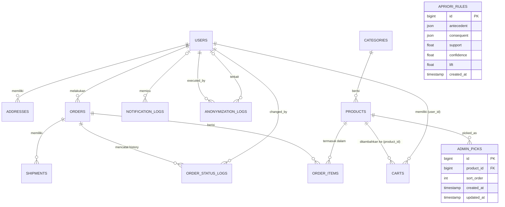
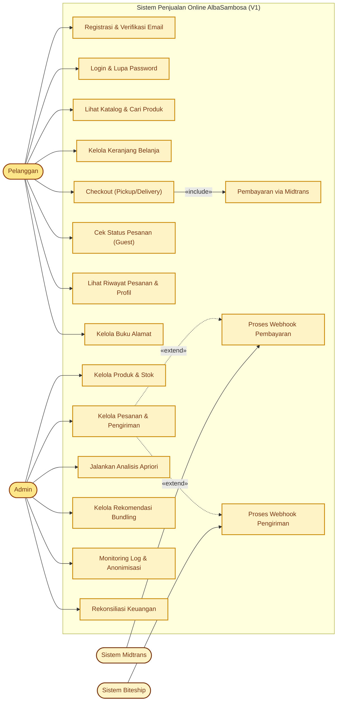
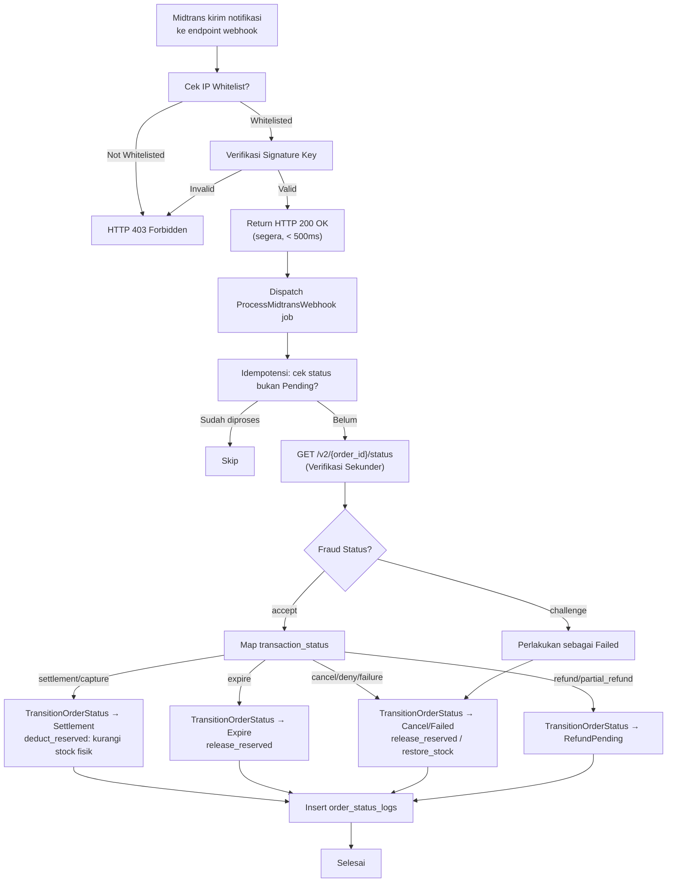

# Product Requirements Document (PRD) – Versi 5.17 (Admin UX)

**Versi Dokumen:** 5.19 (Header, Footer & Auth Page Redesign)
**Tanggal:** 17 Juli 2026
**Status:** Final – Siap Implementasi

> **Changelog v5.19:** Header & footer redesign: navbar disederhanakan (hapus search bar + link "Menu"), cart badge di paling kanan (icon lebih besar + badge accent), mobile: cart di luar hamburger menu, tombol Masuk/Daftar centered full-width di dropdown. Footer 3 kolom: Brand (+sosmed IG/TikTok/FB), Navigasi (Menu, Tentang Kami, Cara Pesan, Lacak Pesanan, Kritik & Saran), Info Toko (alamat, jam operasional, WA). Bottom bar centered. Halaman auth (login, register, forgot password): heading dengan Playfair Display SC, back button "Kembali ke Menu" di pojok kiri atas (override "Kembali ke Login" untuk forgot password), input border lebih tegas (`border-foreground/30` + focus ring). Layout consolidation: hapus `layouts/app.blade.php` + `layouts/navigation.blade.php` (digantikan `components/layouts/app.blade.php` + `components/navbar.blade.php`). Config sosial media di `config/app.php` + `.env`. Newsletter ditunda ke V2.
>
> **Changelog v5.18:** Sidebar admin & seluruh UI Filament di-localize ke **English** (locale `en`, group: Orders/Products/Users/System, label resource: Order/Product/Category/Admin Picks/User/Notification Logs). Dashboard title "Dasbor" → "Dashboard" via custom `AdminDashboard` class. View Product diganti dari page terpisah jadi **modal** (`Action::make('view')` + `schema()` dengan layout Grid 3: gambar 240px + field 2 kolom + description full-width). Default image produk: `food-tray.png` via `defaultImageUrl()` + accessor di model. Halaman `ViewProduct` dihapus. Semua tombol aksi, notifikasi, heading, filter, dan label export di-english-kan. Tests: 258/258 passing (OrderExportTest updated).
>
> **Changelog v5.17:** Halaman Log Anonimisasi di-refactor jadi halaman **Pengguna** (`UserResource`, `/admin/users`, sidebar grup "Users", ikon `heroicon-o-users`). Widget `RegisteredUsersWidget` di header halaman: tabel user terdaftar (nama, email, badge verifikasi, tanggal daftar, pesanan completed — dihitung via `withCount` + sortable). Tombol **Anonimkan** di tiap baris dengan konfirmasi modal + auto-redirect setelah berhasil. Kolom `admin_id` dan `ip_address` dihapus dari `anonymization_logs` (migration + model + resource + factory + service). Kolom Verifikasi di widget (Verified hijau / Unverify amber, pakai `->state()` bukan `formatStateUsing`). Pagination widget pakai `PaginationMode::Default` (nomor halaman, bukan Simple). Login page: checkbox "Ingat saya" default checked via custom `Login` class. Artisan command `make:admin` (interaktif + non-interaktif, validasi email unique/format + password min 8). Seeder: 100 customer (85 verified + 15 unverified), masing-masing 1-4 pesanan completed, total 511 pesanan (47 guest + 264 customer + 200 apriori).
>
> **Changelog v5.16:** Design system upgrade — tipografi brand (Josefin Sans) + migrasi palette warna (Warm Earth + Cream). Brand name "AlbaSambosa" sekarang pakai Josefin Sans (terpisah dari heading Playfair Display SC). Palette dari Appetizing Red (#DC2626) ke Warm Earth + Cream (#92400E brown, #FEF3C7 cream, #CA8A04 gold accent). 22 file bertema ulang: semua komponen Breeze, halaman auth/profile, status order, flash messages, navigation, modal. 3 token semantic baru: `--color-success`, `--color-warning`, `--color-info`. Admin panel: `Color::Red` → `Color::Amber`. `--color-secondary` dan `--color-on-primary` dihapus (tidak terpakai). Spesifikasi lengkap: `docs/superpowers/specs/2026-07-14-brand-typography-design.md` + `docs/superpowers/specs/2026-07-14-color-system-design.md`.
>
> **Changelog v5.15:** Fase 5A.1 (Automated Testing) selesai — 241 tests, 607 assertions. §12 direstruktur: kolom "Fase Verifikasi" (5A.1/5A.2/5B/6), 3 item UAT baru (U-40 Error State, U-41 Empty State, U-42 Mobile). 2 bug difix: `AddToCart::firstOrCreate` crash (price NOT NULL), AprioriService filter Lift ≤ 1. AP-04 diperbarui: hanya rules dengan Lift > 1 yang disimpan.
>
> **Changelog v5.14:** Review menyeluruh Fase 4 (Biteship, WhatsApp, Apriori, Anonimisasi, Caching). 22 temuan difix: 1 bug, 9 high priority, 8 medium, 4 low.
>
> **Bug:** `benchmark.py` import `pandas` setelah pemakaian `pd.DataFrame()` – fixed.
>
> **High Priority:**
> - (H1) Index `waybill_id` di tabel `shipments` – migration baru.
> - (H2) Warning log saat `BITESHIP_MOCK=true` di production (IP whitelist bypass).
> - (H3) **Breaking change:** `apriori_rules` sekarang menyimpan product ID (bukan nama). Rename produk tidak akan memutuskan rules. `RecommendationService`, `AprioriDashboard`, `UnderperformingProductsWidget` diupdate untuk resolve nama dari ID. `ImportHistoricalAprioriRules` mapping nama→ID saat import.
> - (H4) Race condition di `AnonymizeRegistered` – `anonymizeUser()` sekarang `$user->refresh()` + guard ulang `anonymized_at` di dalam transaction.
> - (H5) Fitur pengecualian akun: kolom `anonymization_exempt` (bool) di `users`. Command `privacy:anonymize-registered` filter `where('anonymization_exempt', false)`.
> - (H6) `CategoryObserver` sekarang clear cache individual produk (`product:{id}`) saat kategori di-rename.
> - (H7) `TransitionOrderStatus` increment `catalog_version` saat `Settlement` (total_sold berubah → invalidasi best-seller cache).
> - (H8) Default courier Biteship `gojek`→`gosend` (sesuai API code resmi).
> - (H9) Alamat toko & jam operasional WhatsApp dipindah ke `config/services.php` (`TWILIO_STORE_ADDRESS`, `TWILIO_STORE_HOURS`).
> - (H10) **Simplifikasi Kategori:** CategoryResource jadi modal-based (1 halaman List, tanpa Create/Edit page). Auto-slug (copy dari Product::uniqueSlug). Auto-order (`max+1`). FK `category_id` di `products` diubah dari `cascadeOnDelete` ke `restrictOnDelete` + UI tolak hapus jika kategori berisi produk.
>
> **Medium Priority:**
> - (M1) `BiteshipService` HTTP client tambah `->retry(3, 1000)`.
> - (M2) Komentar eksplisit di `BiteshipBalanceWidget` – V2 fetch saldo real.
> - (M3) `ProcessBiteshipWebhook` implement `ShouldBeUnique` + `uniqueFor(300)`.
> - (M4) Normalisasi nomor WA non-Indonesia: return null + log warning, tidak lagi blind prepend `+62`.
> - (M5) `NotificationLog` failure dipindah ke `failed()` hook – tidak lagi duplicate setiap retry.
> - (M6) Dead config `batch_size` dihapus dari `config/apriori.php`.
> - (M7) `UnderperformingProductsWidget` pakai cache 60 menit + kompatibel dengan H3 (ID-based rules).
> - (M8) Logika retensi diekstrak ke `AnonymizationService::getRetentionCutoff()` – single source of truth.
>
> **Low Priority:**
> - (L1) 3 test baru: IP whitelist rejection, shipment-not-found, terminal order skip.
> - (L2) Tombol "Generate Rules" di AprioriDashboard sekarang `Artisan::queue()` (async).
> - (L3) Komentar "ONE-TIME SCRIPT" di `clean_and_mine.py`.
> - (L4) `AnonymizeGuests` sekarang juga nullify `recipient_name` + `address_detail`.
>
> **Stats:** 24 file, 203 tests (502 assertions), 2 migration baru. Pint passed.

> **Changelog v5.13:** Review Fase 3 (Midtrans Payment + Admin Panel Filament). 2 bug P0 diperbaiki: (1) AddToCart crash — `price` mass-assignment di `Cart::firstOrCreate()` menyebabkan MySQL strict-mode INSERT rejection. Fix: direct property assignment setelah create. (2) `restore_stock` phantom `stock_reserved` — cancel/fail dari post-deduction state meng-increment `stock_reserved` yang sudah 0, menciptakan ghost reservation. Fix: restore hanya `stock` fisik, `stock_reserved` tidak disentuh. State machine diperluas: 18 transisi valid (tambah `processing → cancel`, `processing → failed`, `ready_pickup → failed`). CartFactory: `afterMaking` hook untuk price. Test: 4 assertion di-update.

> **Changelog v5.12:** Update konfigurasi bisnis dari Pak Fauzan. Alamat toko, kode pos, nomor telepon, dan jam operasional (09:00–20:00 WIB) dikonfirmasi. Backup database: **Cloudflare R2** dipilih sebagai solusi utama (10 GB gratis, S3-compatible, tanpa egress fee) menggantikan AWS S3. Slot pickup di checkout disesuaikan ke 09:00–19:00 (sebelumnya 10:00–17:00). Template WhatsApp notifikasi diselaraskan dengan alamat & jam operasional baru. Kategori "Test" dibersihkan dari database. 17 produk dikonfirmasi sesuai `daftar-menu-alba-sambosa.xlsx`.

> **Changelog v5.9:** Review & hardening Fase 1.1—1.3 selesai. Fase 1.1: pin Tailwind CSS v4, Sentry pindah ke `require`, timezone Asia/Jakarta, session encrypt default `true`, queue `after_commit: true`, trust proxy via `TRUSTED_PROXIES` env, font Karla, admin panel Color::Red, emoji removal, Sentry `Integration::handles()`. Fase 1.2: `NotificationLog.status` dihapus dari `$fillable` (harus di-set via gateway eksternal), enum cast `NotificationType` + `AnonymizationActionType`, method `assignRole()`/`scopeIsDefault()`/`scopeAvailable()`, `AddressFactory` field lengkap, job notifikasi set status via instance, migration `phone_nullable` dijalankan. Fase 1.3: 5 diagram Mermaid diperbarui (state machine dual-path Pickup/Delivery, sequence hapus `ProcessOrder` non-existent, Biteship hanya `picked_up`+`delivered` trigger order transition, Midtrans tambah fraud challenge + IP-first, ERD tambah `AdminPick` + missing columns), MASTER.md category `Biotech`→`Food & Beverage`. 200 tests passing (per review Fase 2B).

> **Changelog v5.8:** Fase 4.3 (Apriori) selesai — implementasi native PHP, 17 produk asli Alba Sambosa, 5 rules (semua lift > 1), CSV manual mapping untuk data historis, benchmark Python. Import Excel one-time via script, tidak perlu UI upload. Dashboard Apriori + Chart.js + UnderperformingProductsWidget.  
**Disusun oleh:** Tim Riset & Pengembang Teknologi  
**Project Owner:** Pak Fauzan (AlbaSambosa)

---

## 1. Executive Summary

AlbaSambosa, sebuah UMKM kuliner di bidang _frozen food_, menghadapi tantangan klasik dalam transformasi digital: sistem pemesanan manual, data transaksi yang mengendap sebagai arsip pasif, dan proses konfirmasi pembayaran yang lambat. Di sisi lain, tumpukan data histori penjualan (445 transaksi (Nov 2025 – Apr 2026)) menyimpan pola pembelian konsumen yang belum pernah digali—padahal informasi tersebut dapat menjadi kunci strategi promosi dan paket produk (_bundling_) yang tepat sasaran.

Proyek ini membangun sistem penjualan _online_ yang mengintegrasikan:

- **Algoritma Apriori** – menganalisis data transaksi dan menghasilkan rekomendasi _bundling_ secara otomatis.
- **Midtrans** – sebagai _payment gateway_ untuk otomatisasi pembayaran.
- **Biteship** – sebagai agregator pengiriman (GoSend/GrabExpress).

**Fokus V1.0 (MVP):** Stabilitas transaksi, keamanan data, dan kepatuhan terhadap UU PDP. Fitur-fitur non-kritis seperti verifikasi WhatsApp kompleks dan data portability ditunda ke V2 untuk memastikan waktu rilis yang realistis (± 25 minggu setelah optimasi).

---

## 2. Project Overview

| **Nama Proyek**             | Sistem Penjualan Online AlbaSambosa                                                                                                                          |
| :-------------------------- | :----------------------------------------------------------------------------------------------------------------------------------------------------------- |
| **Tipe Proyek**             | Penelitian Terapan & Kolaborasi Industri                                                                                                                     |
| **Mitra Industri**          | UMKM AlbaSambosa (Kuliner _Frozen Food_)                                                                                                                     |
| **Tujuan Utama**            | Mengembangkan sistem _e-commerce_ terintegrasi dengan _Market Basket Analysis_ (Apriori), _Payment Gateway_ (Midtrans), dan _Delivery Aggregator_ (Biteship) |
| **Pendekatan Pengembangan** | _Build from scratch_ (framework Laravel) — bukan _customization_ CMS                                                                                         |
| **Target Pengguna**         | Pelanggan umum dan staf administrasi AlbaSambosa                                                                                                             |
| **Lingkup Geografis**       | Satu lokasi toko tetap (tidak ada cabang). Layanan pengiriman mencakup area yang didukung oleh GoSend/GrabExpress melalui Biteship                           |

---

## 3. Goals & Objectives

### 3.1. Business & Functional Goals

|  #  | Tujuan                                                  | Deskripsi                                                                                                              |
| :-: | :------------------------------------------------------ | :--------------------------------------------------------------------------------------------------------------------- |
|  1  | **Mendigitalkan Proses Penjualan**                      | Mengubah proses pemesanan manual menjadi platform _e-commerce_ yang sistematis dan dapat diakses 24 jam                |
|  2  | **Otomatisasi Pembayaran**                              | Mengintegrasikan Midtrans untuk pembayaran otomatis melalui berbagai metode (VA, _e-wallet_, QRIS, kartu kredit/debit) |
|  3  | **Optimalisasi Pengiriman**                             | Menyediakan opsi pengiriman via Biteship (GoSend/GrabExpress) di samping metode _pickup_                               |
|  4  | **Peningkatan Penjualan (_Upselling_) melalui Apriori** | Menganalisis pola pembelian dari **445 transaksi historis (Nov 2025 – Apr 2026)** untuk menghasilkan rekomendasi _bundling_ yang relevan     |
|  5  | **Stimulasi Produk Kurang Laku**                        | Mengidentifikasi produk jarang dibeli yang memiliki hubungan kuat dengan produk laris                                  |
|  6  | **Kepatuhan Dasar UU PDP**                              | Menjamin perlindungan data pribadi dengan mekanisme retensi, anonimisasi sederhana, dan transparansi cookie            |

### 3.2. Research & Technical Validation Goals

|  #  | Tujuan                                 | Deskripsi                                                                                                                           |
| :-: | :------------------------------------- | :---------------------------------------------------------------------------------------------------------------------------------- |
|  1  | **Validasi Empiris**                   | Menyediakan bukti empiris implementasi Algoritma Apriori dalam ekosistem _e-commerce_ berskala produksi                             |
|  2  | **Pengujian Kinerja (_Benchmarking_)** | Memvalidasi akurasi implementasi _native_ PHP terhadap pustaka standar (Python) menggunakan dataset identik                         |
|  3  | **Artefak yang Terdokumentasi**        | Menghasilkan purwarupa sistem fungsional, laporan _benchmark_, serta repository GitHub terstruktur sebagai rekam jejak pengembangan |

---

## 4. Project Scope

### 4.1. In-Scope (V1.0 – MVP)

> **Catatan MVP:** Fitur dengan label **[MVP]** bersifat **wajib** untuk operasional toko. Fitur tanpa label bersifat pendukung dan dapat dinegosiasikan jika waktu terbatas.

#### A. Fungsionalitas Inti E-Commerce **[MVP]**

|  #  | Fitur                          | Deskripsi                                                                                                                                                                                                                  |
| :-: | :----------------------------- | :------------------------------------------------------------------------------------------------------------------------------------------------------------------------------------------------------------------------- |
|  1  | **Katalog Produk**             | Menampilkan produk, harga, dan stok dengan fitur pencarian dan filter dasar                                                                                                                                                |
|  2  | **Keranjang Belanja**          | Operasi CRUD reaktif (Livewire). **Guest** menggunakan session-based cart (disimpan di session), **Registered** menggunakan database (`user_id`).                                                                          |
|  3  | **Proses Checkout**            | Mendukung _Pickup Only_ dan _Delivery_ (dengan integrasi Biteship)                                                                                                                                                         |
|  4  | **Reservasi Stok Otomatis**    | Saat pelanggan berhasil membuat pesanan (`pending`), stok produk otomatis dikurangi sementara (`stock_reserved`) untuk mencegah _overselling_. Stok dikembalikan jika pesanan batal/kadaluwarsa                            |
|  5  | **Guest Checkout**             | Pelanggan wajib mencentang persetujuan UU PDP. Nomor telepon wajib diisi dan divalidasi formatnya (`libphonenumber`). Guest **tidak memiliki riwayat pesanan** selain melalui halaman Cek Status.                          |
|  6  | **Autentikasi Opsional**       | Registrasi akun untuk menyimpan riwayat pesanan. Dilengkapi fitur lupa password dan verifikasi email wajib                                                                                                                 |
|  7  | **Buku Alamat (Address Book)** | Pelanggan terdaftar dapat menyimpan dan memilih alamat pengiriman saat checkout (_delivery_)                                                                                                                               |
|  8  | **Cookie Consent**             | Banner persetujuan cookie pada kunjungan pertama dengan opsi **"Setuju"** (semua cookie) dan **"Tolak"** (hanya cookie esensial). Daftar cookie dijelaskan di halaman kebijakan cookie.                                    |
|  9  | **Order Number**               | Format sederhana: `ALBA-YYYYMMDD-` + ID unik. **Contoh:** `ALBA-20260707-001`. `ID` adalah nilai `orders.id` yang di-padding 3 digit (auto-increment global, **tidak direset harian**). Tanggal diambil dari `created_at`. |
| 10  | **Guest Checkout (Batasan)**   | Pelanggan guest hanya bisa mengecek status melalui halaman khusus (order number + nomor telepon), **tidak** memiliki dashboard riwayat seperti user terdaftar.                                                             |

#### B. Integrasi Payment Gateway (Midtrans) **[MVP]**

|  #  | Fitur                           | Deskripsi                                                                                                                                                                                                                                                                                                                                                                                           |
| :-: | :------------------------------ | :-------------------------------------------------------------------------------------------------------------------------------------------------------------------------------------------------------------------------------------------------------------------------------------------------------------------------------------------------------------------------------------------------- |
|  1  | **Metode Pembayaran**           | Mendukung Kartu Kredit/Debit, _E-Wallet_ (GoPay, OVO), Virtual Account, QRIS                                                                                                                                                                                                                                                                                                                        |
|  2  | **Pembuatan Token**             | Server-side (Laravel) menggunakan _Server Key_                                                                                                                                                                                                                                                                                                                                                      |
|  3  | **Verifikasi Webhook Asinkron** | Endpoint menerima notifikasi dari Midtrans. **Verifikasi dilakukan dengan Server Key** menggunakan library resmi `midtrans` (bukan HMAC-SHA512). **Rekomendasi tambahan:** lakukan `GET /v2/{order_id}/status` untuk memverifikasi keabsahan notifikasi (best practice). Whitelist IP (daftar di bawah) sebagai lapisan tambahan. Endpoint langsung return `HTTP 200 OK` dan dispatch job ke Queue. |
|  4  | **Keamanan Webhook**            | Idempotensi (cek `order_id` sebelum update) + **IP Whitelist** (lihat daftar di bawah)                                                                                                                                                                                                                                                                                                              |
|  5  | **Penanganan Kadaluwarsa**      | Parameter `expiry` 1 jam + command pengecekan `pending` > 1 jam setiap 1 jam (sebagai pengaman)                                                                                                                                                                                                                                                                                                   |
|  6  | **Pembatalan Mandiri**          | Pelanggan dapat membatalkan saat `pending` melalui halaman Riwayat/Cek Status                                                                                                                                                                                                                                                                                                                       |

**IP Whitelist Midtrans (untuk incoming webhook) – Update Agustus 2026:**

| Environment    | IP Addresses (CIDR)                                                                                                                                                                                                                                                                                                                                                                                                                                                                                                                                                                                                                                                                                                                                                                                                                                                                                                                                                                                                   |
| -------------- | --------------------------------------------------------------------------------------------------------------------------------------------------------------------------------------------------------------------------------------------------------------------------------------------------------------------------------------------------------------------------------------------------------------------------------------------------------------------------------------------------------------------------------------------------------------------------------------------------------------------------------------------------------------------------------------------------------------------------------------------------------------------------------------------------------------------------------------------------------------------------------------------------------------------------------------------------------------------------------------------------------------------- |
| **Sandbox**    | `34.142.147.133/32`, `34.142.169.131/32`, `34.142.231.22/32`, `35.240.161.215/32`, `34.142.227.232/32`, `34.124.184.175/32`, `35.197.130.2/32`, `34.142.233.114/32`, `8.215.26.211/32`, `8.215.22.135/32`, `8.215.93.92/32`, `8.215.93.214/32`, `8.215.93.76/32`, `8.215.33.37/32`, `8.215.26.148/32`, `8.215.194.225/32`, `8.215.12.199/32`, `149.129.255.111/32`, `149.129.216.115/32`, `147.139.167.196/32`, `147.139.179.47/32`, `147.139.144.184/32`, `147.139.169.196/32`, `147.139.168.217/32`, `8.215.17.96/32`, `149.129.254.13/32`, `147.139.203.227/32`, `147.139.192.94/32`, `147.139.206.250/32`, `147.139.213.108/32`, `8.215.23.167/32`, `147.139.209.91/32`, `8.215.21.228/32`, `147.139.173.83/32`, `147.139.132.215/32`, `149.129.227.68/32`, `149.129.234.77/32`, `147.139.137.231/32`, `147.139.180.156/32`, `8.215.10.65/32`, `8.215.22.163/32`, `147.139.215.190/32`, `8.215.0.89/32`, `8.215.16.140/32`, `147.139.165.251/32`, `147.139.209.83/32`, `147.139.167.157/32`, `147.139.192.232/32` |
| **Production** | `13.228.166.126/32`, `52.220.80.5/32`, `3.1.123.95/32`, `8.215.30.222/32`, `147.139.209.49/32`, `8.215.32.142/32`, `147.139.163.77/32`, `8.215.25.24/32`, `8.215.3.193/32`, `147.139.210.20/32`, `149.129.238.95/32`, `8.215.9.206/32`, `147.139.134.22/32`, `149.129.253.222/32`, `8.215.56.174/32`, `8.215.27.65/32`, `147.139.129.139/32`, `149.129.192.10/32`, `8.215.15.117/32`, `149.129.234.6/32`, `8.215.79.106/32`, `149.129.192.204/32`, `8.215.83.17/32`, `147.139.197.147/32`, `147.139.207.105/32`, `147.139.193.191/32`, `147.139.201.222/32`, `8.215.82.175/32`, `149.129.218.45/32`, `8.215.10.140/32`, `8.215.83.130/32`, `147.139.206.209/32`, `8.215.75.234/32`                                                                                                                                                                                                                                                                                                                                    |

> **Catatan:** IP di atas khusus untuk **incoming webhook** (dari Midtrans ke server). Untuk request keluar (server ke Midtrans), Midtrans **tidak merekomendasikan** whitelist IP karena dinamis. Daftar ini dapat berubah; tim pengembang wajib memeriksa ulang di dokumentasi resmi Midtrans sebelum deployment.

#### C. Integrasi Delivery Aggregator (Biteship) **[MVP]**

|  #  | Fitur                 | Deskripsi                                                                                                                                                                                                                                                                                                                                                                                         |
| :-: | :-------------------- | :------------------------------------------------------------------------------------------------------------------------------------------------------------------------------------------------------------------------------------------------------------------------------------------------------------------------------------------------------------------------------------------------ |
|  1  | **Opsi Kurir**        | Menampilkan opsi kurir GoSend dan GrabExpress                                                                                                                                                                                                                                                                                                                                                     |
|  2  | **Cek Biaya**         | _Real-time_ dengan **cache 5 menit**                                                                                                                                                                                                                                                                                                                                                              |
|  3  | **Pembuatan Pesanan** | Otomatis setelah Admin memproses pesanan. Nomor resi dihasilkan                                                                                                                                                                                                                                                                                                                                   |
|  4  | **Pelacakan**         | Via _webhook_ Biteship. **Verifikasi wajib:** Cek **Header Signature Key** dan **Secret Key** (validasi kriptografis). **Catatan:** Pastikan nilai `signature_key` dan `signature_secret` telah dikonfigurasi di dashboard Biteship saat membuat webhook. Whitelist IP sebagai lapisan tambahan (mengacu daftar resmi Biteship). Proses asinkron via Queue dengan idempotensi (cek `waybill_id`). |
|  5  | **Notifikasi**        | Notifikasi WhatsApp via **Twilio** untuk 4 milestone: **"Pembayaran Berhasil"** (Settlement), **"Dalam Pengiriman"** (Shipping), **"Siap Diambil"** (ReadyPickup), **"Sampai"** (Delivered). Setiap notifikasi include link tracking. Shipping include link Biteship jika waybill_id tersedia (fallback ke `notification_logs` jika gagal)                                                                                                                                                                                                                                  |

#### D. Modul Analisis Apriori (Admin) ✅

|  #  | Fitur                            | Status | Deskripsi                                                                                                                                                                                                                                                                   |
| :-: | :------------------------------- | :----: | :-------------------------------------------------------------------------------------------------------------------------------------------------------------------------------------------------------------------------------------------------------------------------- |
|  1  | **Impor Data Historis**          |   ✅   | 445 transaksi historis (1412 baris Excel, Nov 2025 – Apr 2026). Cleaning via **Python script** (`rapidfuzz` threshold ≥ 70% auto-match, < 70% fallback ke **CSV mapping** — 47 varian nama dipetakan otomatis). Tidak perlu UI upload (one-time task).                                          |
|  2  | **Parameter**                    |   ✅   | _Minimum Support_ (default 2%) dan _Minimum Confidence_ (default 60%). Konfigurabel via `config/apriori.php`.                                                                                                                                                               |
|  3  | **Output**                       |   ✅   | Nilai _Support_, _Confidence_, dan _Lift_. Hasil historis: 5 rules (semua lift > 1, max 1.44).                                                                                                                                                                              |
|  4  | **Visualisasi**                  |   ✅   | Grafik batang _Top 10 rules_ (Chart.js) di halaman **AprioriDashboard** Filament.                                                                                                                                                                                           |
|  5  | **Dashboard Produk Kurang Laku** |   ✅   | **UnderperformingProductsWidget** — produk di _consequent_ dengan lift > 1 dan `total_sold` rendah, lengkap dengan produk pasangan (_antecedent_) terbaik.                                                                                                                   |
|  6  | **Eksekusi**                     |   ✅   | Tombol "Generate Rules" di dashboard (async via `Artisan::queue()`) + _cronjob_ **bulanan** (Minggu ke-1, 01:00 WIB, timezone `Asia/Jakarta`). Single-pass in-memory untuk skala V1, siap scale ke Job Batching.                                                                                           |
|  7  | **Cold-start Fallback**          |   ✅   | Level 1 (Apriori) → Level 2 (Best Seller per Kategori) → Level 3 (Global Best Seller) → Level 4 (Admin Picks). **Filter:** produk habis stok (`stock <= 0`) tidak muncul. Cache 10 menit. **Admin Picks** ditampilkan sesuai urutan yang ditentukan Admin.                 |
|  8  | **Lokasi Tampilan Rekomendasi**  |   ✅   | Rekomendasi bundling (Apriori) ditampilkan di **halaman detail produk** (section "Beli Bersama") dan di **halaman keranjang** (sebagai saran tambahan).                                                                                                                     |
|  9  | **Benchmarking**                 |   ✅   | Cross-validation PHP vs Python (`mlxtend`) via `scripts/apriori/benchmark.py`. Export data: `php artisan apriori:export-data`.                                                                                                                                              |

#### E. Modul Admin (Filament) **[MVP]**

|  #  | Fitur                            | Deskripsi                                                                                                                 |
| :-: | :------------------------------- | :------------------------------------------------------------------------------------------------------------------------ |
|  1  | **Pengelolaan Dasar**            | CRUD produk, stok, dan pesanan                                                                                            |
|  2  | **Ringkasan Penjualan**     | Dashboard menampilkan ringkasan pesanan & pendapatan hari ini dan bulan ini (`SalesSummaryWidget`). Rekonsiliasi keuangan (perbandingan settlement vs processing) ditunda ke V2. |
|  3  | **Laporan**                      | Ekspor laporan penjualan (PDF/Excel)                                                                                      |
|  4  | **Manajemen Menu & Promo**       | Manajemen kategori dan promo sederhana                                                                                    |
|  5  | **Monitoring Saldo Biteship**    | Link ke dashboard Biteship (cek manual)                                                                                  |
|  6  | **Konfigurasi Retensi**          | Pengaturan retensi data Guest (default 24 bulan) dan Registered (default 36 bulan)                                        |
|  7  | **Log Terpusat**                 | Tabel `notification_logs` — channel via `metadata.channel` (whatsapp/biteship). Mencakup kegagalan notifikasi WA & pengiriman. |
|  8  | **Pilihan Admin**                | Manajemen **"Pilihan Admin"** (maks 5 produk) untuk fallback Level 4. Urutan tampilan dapat diatur Admin.                 |
|  9  | **Audit Trail**                  | Setiap perubahan status pesanan tercatat di `order_status_logs`                                                           |
| 10  | **Queue Monitoring**             | Halaman daftar _failed jobs_ dengan opsi _retry_ & _delete_. Semua job: `tries=3`, `backoff=[30,60,120]`.                  |

#### F. Kepatuhan UU PDP (Sederhana untuk V1)

|  #  | Fitur                         | Deskripsi                                                                                                                                                                                                                                                                                                                                            |
| :-: | :---------------------------- | :--------------------------------------------------------------------------------------------------------------------------------------------------------------------------------------------------------------------------------------------------------------------------------------------------------------------------------------------------- |
|  1  | **Persetujuan (Consent)**     | Pada Guest Checkout dan Registrasi                                                                                                                                                                                                                                                                                                                   |
|  2  | **Cookie Consent**            | Banner cookie di kunjungan pertama dengan opsi **Setuju** / **Tolak**. Cookie esensial (session, CSRF) tetap aktif meskipun ditolak.                                                                                                                                                                                                                 |
|  3  | **Halaman Kebijakan Cookie**  | Halaman statis `/kebijakan-cookie` (template Blade) yang mencantumkan daftar cookie yang digunakan.                                                                                                                                                                                                                                                  |
|  4  | **Halaman Kebijakan Privasi** | Halaman statis `/kebijakan-privasi` (template Blade)                                                                                                                                                                                                                                                                                                 |
|  5  | **Verifikasi Email Wajib**    | Saat registrasi                                                                                                                                                                                                                                                                                                                                      |
|  6  | **Hak Dilupakan**             | Pelanggan dapat mengajukan via **email ke admin@albasambosa.com** atau **WhatsApp Admin**. Admin wajib menganonimkan data identitas secara manual ≤ 7 hari (data transaksi tetap utuh).                                                                                                                                                              |
|  7  | **Anonimisasi Otomatis**      | **Guest:** 24 bulan tanpa peringatan. **Registered:** 36 bulan tanpa peringatan (cukup diumumkan di kebijakan privasi). **Grace Period 7 hari** sebelum eksekusi, dengan fitur pengecualian akun oleh Admin jika diperlukan. **Safety Lock:** Pesanan aktif (`pending`, `settlement`, `processing`, `ready_pickup`, `shipping`) menunda anonimisasi. |

#### G. Keamanan Dasar (Rate Limiting) **[MVP]**

|  #  | Fitur                                  | Deskripsi                                                                                                                                                                                                                                                                              |
| :-: | :------------------------------------- | :------------------------------------------------------------------------------------------------------------------------------------------------------------------------------------------------------------------------------------------------------------------------------------- |
|  1  | **Rate Limiting pada Endpoint Publik** | Menerapkan Laravel Rate Limiter pada beberapa endpoint publik:<br>• **Login:** 5 percobaan gagal per menit per IP<br>• **Cek Status Pesanan (Guest):** 5 hit per menit per IP (mencegah brute-force dan scraping order number)<br>• **Cek Ongkir (Biteship):** 10 hit per menit per IP |

---

### 4.2. Out-of-Scope (Direncanakan untuk Fase 2)

|  #  | Fitur                                     | Alasan Penundaan                                                                         |
| :-: | :---------------------------------------- | :--------------------------------------------------------------------------------------- |
|  1  | Aplikasi Mobile Native (Android/iOS)      | Fokus V1 pada _web_ responsif                                                            |
|  2  | Sistem Loyalitas/Membership               | Membutuhkan analisis lebih lanjut                                                        |
|  3  | Integrasi Marketplace (Shopee, Tokopedia) | Kompleksitas integrasi                                                                   |
|  4  | Voucher Diskon Kode Unik                  | Risiko _bug_ finansial                                                                   |
|  5  | Refund Otomatis via Midtrans API          | Risiko kerugian finansial                                                                |
|  6  | Prediksi Stok Otomatis                    | Membutuhkan data historis lebih panjang                                                  |
|  7  | Login Sosial Media (Google/Facebook)      | Kompleksitas keamanan                                                                    |
|  8  | Wishlist                                  | Non-kritis                                                                               |
|  9  | Ulasan & Rating Produk                    | Memerlukan moderasi                                                                      |
| 10  | Optimasi FP-Growth                        | Dataset masih kecil                                                                      |
| 11  | Upgrade Queue ke Redis                    | Driver database cukup untuk V1                                                           |
| 12  | Verifikasi WhatsApp Click‑to‑Chat         | Menambah kompleksitas dan biaya. V1 menggunakan notifikasi via Twilio/WATI.              |
| 13  | Data Portability (Unduh JSON)             | Tidak kritis untuk operasional toko                                                      |
| 14  | Balasan WhatsApp Admin via Dashboard      | Cukup arahkan pelanggan ke nomor WhatsApp Admin                                          |
| 15  | Reaktivasi Akun dengan Merge Riwayat      | Akun yang dianonimkan dapat mendaftar baru tanpa riwayat                                 |
| 16  | Cloudflare Turnstile                      | Tidak diperlukan di V1 karena Rate Limiting bawaan Laravel sudah cukup untuk skala UMKM. |

---

### 4.3. Code Management & Technical Documentation

Seluruh kode sumber dan artefak teknis dikelola menggunakan **Git** dengan repository pusat di **GitHub**.

**Struktur Repository (Best Practice):**

```
project-root/
├── PRD.md                       # Dokumen PRD (hidup — sering diupdate)
├── TASK.md                      # Task list development (hidup — sering diupdate)
├── src/                         # Kode sumber utama Laravel (app/, bootstrap/, dll.)
├── database/                    # Migration & Seeder
├── tests/                       # Unit & Feature Tests
├── scripts/                     # Script utility (validasi Apriori, dll.)
├── docs/                        # Artefak statis — diagram, wireframe, API spec, legal
│   ├── design/                  # Aset visual & desain
│   │   ├── diagrams/            # ERD, UML, Flowchart (.mermaid/.drawio)
│   │   │   ├── erd/             # Entity Relationship Diagram
│   │   │   └── flows/           # Use Case, Activity, Sequence, State Machine
│   │   └── wireframes/          # Mockup UI (Figma, Balsamiq, PNG)
│   ├── api/                     # Spesifikasi OpenAPI 3.0 (openapi.yaml) hasil Scribe
│   └── legal/                   # Kebijakan Privasi, Cookie Policy, Terms
├── .env.example                 # Contoh environment variables
├── README.md                    # Panduan proyek
└── ... (File konfigurasi: composer.json, package.json, etc.)
```

**Catatan Struktur:**

- **PRD.md** dan **TASK.md** disimpan di root karena merupakan dokumen hidup yang sering diupdate sepanjang development.
- **Diagram** disimpan di `/docs/design/diagrams/` — merepresentasikan logika dan arsitektur sistem.
- **Wireframe** disimpan di `/docs/design/wireframes/` — merepresentasikan antarmuka pengguna (UI).
- `docs/` hanya untuk artefak statis yang jarang berubah setelah dibuat.

**API Documentation Strategy (Tanpa Postman/Insomnia):**

- **Laravel Scribe (`knuckleswtf/scribe`)** – Menghasilkan spesifikasi OpenAPI 3.0 secara otomatis dari kode.
- **Alur Sinkronisasi Scribe → Apidog:**
  1. Developer menjalankan `php artisan scribe:generate` untuk menghasilkan file `openapi.yaml` di `/docs/api/`.
  2. File `openapi.yaml` di-_version control_ ke repository.
  3. Tim QA/Dev mengimpor file tersebut ke **Apidog** secara manual (atau via Apidog CLI) untuk keperluan debugging, mock server, dan kolaborasi.
  4. Setiap perubahan API wajib diikuti dengan regenerasi Scribe dan update import ke Apidog.
- **Catatan:** Sistem **tidak menggunakan Postman atau Insomnia**. Seluruh koleksi API, testing, dan mock server dikelola melalui Apidog.

**Strategi Branching:**

- `main` – Stabil, siap produksi
- `develop` – Integrasi fitur
- `feature/*` – Pengembangan modul spesifik

**Standar Pesan Commit** (_Conventional Commits_):
`feat:`, `fix:`, `docs:`, `test:`, `chore:`

---

### 4.4. Fault Tolerance Mechanism (Fallback & Graceful Degradation)

|  #  | Skenario                      | Mekanisme                                                                                                |
| :-: | :---------------------------- | :------------------------------------------------------------------------------------------------------- |
|  1  | **Biteship API Gagal**        | Notifikasi ke user; opsi delivery diblokir, hanya Pickup tersedia (tanpa fallback ongkir)               |
|  2  | **Webhook Midtrans Gagal**    | 3 lapis: (1) auto-sync 15 menit, (2) widget pending >30 menit + "Sync Semua", (3) expire cek dulu       |
|  3  | **Webhook Biteship Gagal**    | Retry otomatis via Biteship; tracking dari dashboard Biteship                                            |
|  4  | **WhatsApp Notifikasi Gagal** | Gunakan fallback email (jika ada) atau catat di `notification_logs` (Admin dapat menghubungi manual)     |
|  5  | **Race Condition Stok**       | Menggunakan transaksi database (DB Transaction) + `lockForUpdate()`                                      |

---

### 4.5. Infrastructure & Deployment Specification

Sistem wajib dijalankan pada lingkungan **Virtual Private Server (VPS)**.

#### Spesifikasi Minimum

| Komponen       | Spesifikasi Minimum | Rekomendasi      |
| :------------- | :------------------ | :--------------- |
| **CPU**        | 2 vCore             | 4 vCore          |
| **RAM**        | 2 GB                | 4 GB             |
| **Storage**    | 20 GB SSD           | 50 GB SSD        |
| **OS**         | Ubuntu 24.04 LTS    | Ubuntu 24.04 LTS |
| **Web Server** | Nginx 1.24+         | Nginx 1.24+      |
| **Database**   | MySQL 8.4 LTS       | MySQL 8.4 LTS    |
| **PHP**        | PHP 8.3 (LTS)       | PHP 8.3 (LTS)    |

#### Lingkungan dan Layanan Pendukung

| Komponen             | Deskripsi                                                                                                                                                                            |
| :------------------- | :----------------------------------------------------------------------------------------------------------------------------------------------------------------------------------- |
| **Queue Worker**     | Laravel Queue driver **database**. Diawasi Supervisor (minimal 1 worker). **Konfigurasi retry:** attempts = 3, backoff = 5 menit, timeout = 60 detik. Job gagal masuk `failed_jobs`. |
| **Scheduler**        | Laravel Scheduler via cronjob sistem (setiap menit)                                                                                                                                  |
| **SSL/TLS**          | Let's Encrypt untuk seluruh endpoint publik                                                                                                                                          |
| **Firewall**         | UFW/iptables (SSH, HTTP, HTTPS). Whitelist IP untuk webhook mengacu pada dokumentasi Midtrans dan Biteship.                                                                          |
| **Error Monitoring** | **Sentry** untuk error kritis (webhook, queue, payment)                                                                                                                              |
| **Cache & Session**  | Driver `database` untuk V1 (upgrade ke Redis jika RAM ≥ 4GB)                                                                                                                         |
| **Backup Database**  | `mysqldump` setiap 02.00 WIB ke **Cloudflare R2** (S3-compatible, 10 GB gratis, tanpa egress fee) dengan retensi **30 hari**. Restore test setiap 3 bulan.                            |
| **Backup File**      | Snapshot VPS harian + script kompresi gambar ke R2.                                                                                                                                  |
| **Environment**      | `.env` (tidak di repository)                                                                                                                                                         |
| **Deployment**       | Manual via SSH (terdokumentasi)                                                                                                                                                      |
| **Maintenance Mode** | `php artisan down` dengan halaman ramah pengguna                                                                                                                                     |

---

### 4.6. Data Model Overview (ERD Reference)

Berikut adalah **Diagram Entitas-Relasi (ERD)** untuk V1.0 yang menggambarkan 13 tabel utama (12 spesifikasi awal + 1 tambahan `admin_picks`) dan relasi antar entitas. Diagram ini disimpan juga sebagai artefak terpisah di `/docs/design/diagrams/erd/erd-v1.0.mermaid` untuk keperluan presentasi.

#### ERD V1.0 – Mermaid



#### Daftar Entitas (13 Tabel)

|  #  | Entitas                | Deskripsi                                                                                                                    | Kolom Penting                                                                                                                                                                              |
| :-: | :--------------------- | :--------------------------------------------------------------------------------------------------------------------------- | :----------------------------------------------------------------------------------------------------------------------------------------------------------------------------------------- |
|  1  | **Users**              | Pelanggan terdaftar                                                                                                          | id, name, email, password, role, last_login_at, email_verified_at, anonymized_at, anonymization_exempt                                                                                  |
|  2  | **Addresses**          | Alamat pengiriman pelanggan                                                                                                  | id, user_id, label, recipient_name, phone (nullable), address_detail, is_default                                                                                                           |
|  3  | **Categories**         | Kategori produk. Slug auto-generated dari name, order auto-increment.                                                        | id, name, slug, order                                                                                                                                                                      |
|  4  | **Products**           | Data produk                                                                                                                  | id, category_id, name, slug, description, price, stock, stock_reserved, image, total_sold                                                                                                  |
|  5  | **Carts**              | Keranjang belanja sementara. **Guest** menggunakan `session_id` (nullable), **Registered** menggunakan `user_id` (nullable). | id, user_id (nullable), session_id (nullable), product_id, quantity, price                                                                                                                 |
|  6  | **Orders**             | Transaksi utama                                                                                                              | id, user_id (nullable), order_number, total_price, status (ENUM), payment_method, shipping_cost, pickup_time, phone, recipient_name, address_detail, postal_code, created_at               |
|  7  | **Order_Items**        | Detail item per pesanan                                                                                                      | id, order_id, product_id, quantity, price                                                                                                                                                  |
|  8  | **Order_Status_Logs**  | Audit trail perubahan status                                                                                                 | id, order_id, old_status, new_status, user_id (admin), created_at                                                                                                                          |
|  9  | **Shipments**          | Data pengiriman Biteship                                                                                                     | id, order_id (unique), waybill_id (indexed), courier, courier_service, tracking_status, estimated_arrival                                                                                |
| 10  | **Apriori_Rules**      | Hasil analisis bundling                                                                                                      | id, antecedent, consequent, support, confidence, lift, created_at                                                                                                                          |
| 11  | **Notification_Logs**  | Log terpusat notifikasi — `metadata.channel`: whatsapp (Twilio) / biteship (gagal kirim)                                    | id, user_id (nullable), metadata (JSON: channel, order_number, phone/waybill_id, error), status (sent/failed), created_at                                                                  |
| 12  | **Anonymization_Logs** | Audit trail untuk Hak Dilupakan dan Anonimisasi Otomatis (append-only, tamper-evident)                                       | id, user_id (nullable), action_type (ENUM: `forgotten_manual`, `auto_anonymize_guest`, `auto_anonymize_registered`), anonymized_fields (JSON), created_at |
| 13  | **Admin_Picks**        | Produk pilihan admin untuk cold-start fallback Level 4 (maks 5)                                                              | id, product_id (FK), sort_order, created_at, updated_at                                                                                                                                    |

> **Catatan:**
>
> - Relasi `USERS` ke `CARTS` kini memiliki dua jalur: untuk user terdaftar (`user_id`) dan untuk guest (`session_id`). Kedua kolom ini bersifat nullable, namun salah satunya harus terisi.
> - Tabel `Anonymization_Logs` bersifat **append-only** dan tidak boleh diubah/dihapus untuk menjamin integritas audit.

#### Status Transaksi (ENUM) – Tabel `orders`

| Status           | Deskripsi                                                                                     |
| :--------------- | :-------------------------------------------------------------------------------------------- |
| `pending`        | Pesanan dibuat, menunggu pembayaran. Stok di-reserve di `stock_reserved`.                     |
| `settlement`     | Pembayaran berhasil (Midtrans). Stok fisik (`stock`) dikurangi, `stock_reserved` dikosongkan. Notifikasi WhatsApp terkirim. |
| `processing`     | Pesanan sedang diproses oleh Admin. Dapat dibatalkan (`cancel`) atau gagal (`failed`).                       |
| `ready_pickup`   | Pesanan siap diambil pelanggan (khusus metode Pickup). Notifikasi WhatsApp terkirim. Dapat gagal (`failed`). |
| `shipping`       | Pesanan dalam perjalanan (kurir). Notifikasi WhatsApp terkirim + link tracking Biteship. Dapat dibatalkan (`cancel`) atau gagal (`failed`). |
| `delivered`      | Pesanan telah sampai ke pelanggan. Notifikasi WhatsApp terkirim.                                            |
| `completed`      | Pesanan selesai (baik pickup sudah diambil atau delivery sudah sampai dan dikonfirmasi).                    |
| `expire`         | Pembayaran kadaluwarsa (1 jam). Efek: `release_reserved` — hanya `stock_reserved` dikembalikan.            |
| `cancel`         | Pesanan dibatalkan. Pre-deduction: `release_reserved`. Post-deduction: `restore_stock` (hanya `stock` fisik). |
| `failed`         | Pembayaran/proses gagal. Pre-deduction: `release_reserved`. Post-deduction: `restore_stock` (hanya `stock` fisik). |
| `refund_pending` | Refund sedang diproses oleh Admin (manual di Midtrans). Warning jika > 7 hari.                |
| `refund_done`    | Refund telah selesai diproses oleh Admin. Status final — tidak bisa berubah.                  |

#### State Machine — 21 Transisi Valid

Transisi yang diizinkan (di-enforce oleh `TransitionOrderStatus::VALID_TRANSITIONS`):

| Status Saat Ini | Target yang Diizinkan | Efek Stok |
|:----------------|:----------------------|:----------|
| `pending` | `settlement`, `expire`, `cancel`, `failed` | settlement: `deduct_reserved`. Lainnya: `release_reserved` |
| `settlement` | `processing` | — (stok sudah di-deduct) |
| `processing` | `ready_pickup`, `shipping`, `failed`, `cancel`, `refund_pending` | failed/cancel: `restore_stock`. refund_pending: auto-cancel + `restore_stock` |
| `ready_pickup` | `completed`, `failed`, `refund_pending` | failed: `restore_stock`. refund_pending: auto-cancel + `restore_stock` |
| `shipping` | `delivered`, `cancel`, `failed`, `refund_pending` | cancel/failed: `restore_stock`. refund_pending: auto-cancel + `restore_stock` |
| `delivered` | `completed`, `refund_pending` | — |
| `cancel` | `refund_pending` | — |
| `refund_pending` | `refund_done` | — |

**Status final (tidak ada transisi keluar):** `completed`, `expire`, `refund_done`

**Catatan:** `cancel`/`failed` dari status post-settlement (`processing`, `ready_pickup`, `shipping`) TIDAK tersedia sebagai aksi manual admin. Gunakan **Refund** — sistem auto-cancel internal + restore stok. Transisi `cancel`/`failed` dari post-settlement hanya via webhook/scheduler. `settlement` hanya dicapai via webhook Midtrans (bukan manual admin). `failed` dari `pending` bisa via webhook Midtrans (`deny`/`failure`).

---

### 4.7. Use Case Overview (Diagram & Actor Mapping)

#### Diagram Use Case – Sistem Penjualan Online AlbaSambosa



#### Tabel Pemetaan Aktor dan Use Case

| Aktor                                | Use Case Utama                                                                                                                                                                | Ref. Requirement |
| :----------------------------------- | :---------------------------------------------------------------------------------------------------------------------------------------------------------------------------- | :--------------- |
| **Pelanggan** _(Guest & Registered)_ | Registrasi, Login, Lupa Password, Lihat Katalog, Kelola Keranjang, Checkout (Pickup/Delivery), Pembayaran, Cek Status (Guest), Lihat Riwayat (Registered), Kelola Buku Alamat | C-01 s.d C-21    |
| **Admin (AlbaSambosa)**              | Kelola Produk & Stok, Kelola Pesanan & Pengiriman, Jalankan Analisis Apriori, Kelola Rekomendasi Bundling, Monitoring Log & Anonimisasi, Rekonsiliasi Keuangan                | A-01 s.d A-17    |
| **Sistem Midtrans**                  | Mengirim notifikasi webhook pembayaran untuk update status transaksi dan stok secara otomatis                                                                                 | M-04, M-06       |
| **Sistem Biteship**                  | Mengirim notifikasi webhook tracking pengiriman                                                                                                                               | B-03             |

#### Status Implementasi Use Case (17 Jul 2026)

| UC | Use Case | Status |
|----|----------|--------|
| UC1 | Registrasi & Verifikasi Email | Implemented |
| UC2 | Login & Lupa Password | Implemented |
| UC3 | Lihat Katalog & Cari Produk | Implemented |
| UC4 | Kelola Keranjang Belanja | Implemented |
| UC5 | Checkout (Pickup/Delivery) | Implemented |
| UC6 | Pembayaran via Midtrans | Implemented |
| UC7 | Cek Status Pesanan (Guest) | Implemented |
| UC8 | Lihat Riwayat Pesanan & Profil | Pending (Fase 2B) — profil sudah, riwayat pesanan belum |
| UC9 | Kelola Buku Alamat | Deferred V2 |
| UC10 | Kelola Produk & Stok | Implemented |
| UC11 | Kelola Pesanan & Pengiriman | Implemented |
| UC12 | Jalankan Analisis Apriori | Implemented |
| UC13 | Kelola Rekomendasi Bundling | Implemented |
| UC14 | Monitoring Log & Anonimisasi | Implemented |
| UC15 | Rekonsiliasi Keuangan | Deferred V2 |
| UC16 | Proses Webhook Pembayaran | Implemented |
| UC17 | Proses Webhook Pengiriman | Implemented |

> Ringkasan: 15/17 implemented, 1 pending (UC8), 2 deferred ke V2 (UC9, UC15).

---

### 4.8. Activity Diagram for Critical Flow (Webhook Midtrans)

Alur ini menggambarkan pemrosesan notifikasi pembayaran dari Midtrans dengan verifikasi berlapis (IP → Signature → Fraud Check → API), pemisahan sinkron/asinkron, dan penanganan stok (_deduct_reserved, release_reserved, restore_stock_). Lihat artefak lengkap di `/docs/design/diagrams/flows/activity-midtrans-webhook.mermaid`.



> **Catatan Implementasi:** Verifikasi dilakukan **IP dulu, baru Signature** (berbeda dari spek awal). Fraud challenge handling: transaksi dengan `fraud_status=challenge` diperlakukan sebagai Failed meskipun `transaction_status` sukses. Stock effects ada 3 mode: `deduct_reserved` (settlement — kurangi `stock` + `stock_reserved`), `release_reserved` (expire/cancel/failed pre-deduction — kembalikan `stock_reserved`), dan `restore_stock` (cancel/failed post-deduction — kembalikan `stock` fisik saja, `stock_reserved` sudah dikosongkan saat settlement dan TIDAK disentuh untuk mencegah phantom reservation). State machine memiliki 18 transisi valid (lihat §4.6 State Machine).

---

## 5. Assumptions & Constraints

### 5.1. Assumptions

|  #  | Asumsi                                                                                    |
| :-: | :---------------------------------------------------------------------------------------- |
|  1  | Data transaksi historis sebanyak **1412 baris** tersedia                                   |
|  2  | Pelanggan memiliki akses ke browser modern dan koneksi internet                           |
|  3  | Pihak AlbaSambosa menyediakan akun Midtrans (_Sandbox_ & _Production_)                    |
|  4  | Pihak AlbaSambosa menyediakan akun Biteship (_Sandbox_ & _Production_)                    |
|  5  | Pihak AlbaSambosa bersedia melakukan _top-up_ saldo Biteship                              |
|  6  | Tim pengembang memiliki akses ke repository GitHub                                        |
|  7  | Infrastruktur VPS disediakan dan dikelola oleh mitra atau pengembang                      |
|  8  | Biaya notifikasi WhatsApp dan SMS menjadi tanggung jawab mitra industri (via Twilio/WATI) |

### 5.2. Constraints

|  #  | Batasan                                                          |
| :-: | :--------------------------------------------------------------- |
|  1  | Apriori hanya menganalisis transaksi `settlement`                |
|  2  | Dataset 445 transaksi sudah memenuhi syarat minimum 50 transaksi |
|  3  | Sistem dirancang untuk **satu lokasi toko tetap**                |
|  4  | Pengiriman hanya melayani area yang dijangkau GoSend/GrabExpress |
|  5  | Sistem **wajib** dijalankan pada VPS (bukan _shared hosting_)    |

---

## 6. User Roles

| Role                | Deskripsi            | Tanggung Jawab                                                                                                                                  |
| :------------------ | :------------------- | :---------------------------------------------------------------------------------------------------------------------------------------------- |
| **Pelanggan**       | Pengguna akhir       | - Menjelajahi katalog & keranjang<br>- Checkout & pembayaran<br>- Melacak status pesanan<br>- (Registered) Login, reset password, kelola alamat |
| **Admin**           | Pengelola toko       | - Kelola produk & stok<br>- Kelola pesanan & pengiriman<br>- Jalankan Apriori<br>- Ekspor laporan<br>- Proses refund manual & anonimisasi data  |
| **Sistem Midtrans** | Payment gateway      | - Memproses pembayaran<br>- Mengirim webhook status                                                                                             |
| **Sistem Biteship** | Agregator pengiriman | - Menghitung ongkir<br>- Membuat pesanan kirim<br>- Mengirim webhook tracking                                                                   |

---

## 7. Functional Requirements

### 7.1. Customer-Facing Module

|    ID    | Requirement                                                                                                                                                                                                                                                                                                                          | Prioritas |
| :------: | :----------------------------------------------------------------------------------------------------------------------------------------------------------------------------------------------------------------------------------------------------------------------------------------------------------------------------------- | :-------: |
| **C-01** | **Guest Checkout** — Tanpa registrasi. Wajib centang UU PDP. Wajib isi nomor telepon valid (`libphonenumber`).                                                                                                                                                                                                                       | **[MVP]** |
| **C-02** | **Katalog Produk** — Daftar produk dengan pencarian dan filter dasar.                                                                                                                                                                                                                                                                | **[MVP]** |
| **C-03** | **Keranjang Belanja Reaktif** — CRUD Livewire tanpa reload. Guest menggunakan session, Registered menggunakan database (`user_id`).                                                                                                                                                                                                  | **[MVP]** |
| **C-04** | **Rekomendasi Apriori** — Menampilkan rekomendasi berbasis _Lift_ di **halaman detail produk** (section "Beli Bersama") dan **halaman keranjang** (saran tambahan). Cold-start fallback 4 level.                                                                                                                                     | **[MVP]** |
| **C-05** | **Checkout Pickup** — Pilih waktu pengambilan. Admin dapat notifikasi real-time.                                                                                                                                                                                                                                                     | **[MVP]** |
| **C-06** | **Checkout Delivery** — Isi alamat atau pilih dari Buku Alamat. Panggil Biteship API. Jika gagal, Admin input manual.                                                                                                                                                                                                                | **[MVP]** |
| **C-07** | **Pembayaran Midtrans** — Snap API. Saat `pending`, stok di-reserve (`stock_reserved`). Stok fisik berkurang saat `settlement`/`processing`.                                                                                                                                                                                         | **[MVP]** |
| **C-08** | **Riwayat Pesanan (Registered)** — Tersimpan di akun dengan format `ALBA-YYYYMMDD-XXX` (`XXX` = ID pesanan padding 3 digit, global auto-increment, tidak direset harian).                                                                                                                                                            |  Sedang   |
| **C-09** | **Riwayat Pesanan (Guest)** — Halaman "Cek Status" dengan input order number + nomor telepon. **Dilindungi Rate Limiting (5 hit/menit per IP)**. Mendukung auto-lookup via query params.                                                                                                                                             | **[MVP]** |
| **C-10** | **Notifikasi WhatsApp** — Kirim notifikasi WA via **Twilio** untuk 4 milestone: **Settlement** (pembayaran berhasil), **Shipping** (dalam pengiriman + link Biteship), **ReadyPickup** (siap diambil), **Delivered** (sampai). Setiap notifikasi include link tracking. Jika gagal → `notification_logs`.                           | **[MVP]** |
| **C-11** | **Hak Dilupakan (Manual)** — Pelanggan ajukan via **email admin@albasambosa.com** atau **WhatsApp Admin**. Admin anonimkan identitas dalam ≤ 7 hari. Data transaksi tetap. Log tercatat di `anonymization_logs`.                                                                                                                     |  Sedang   |
| **C-12** | **Anonimisasi Otomatis Guest** — Command `php artisan privacy:anonymize-guests` untuk data tamu dengan transaksi terakhir > **24 bulan**. Terdapat **grace period 7 hari** sebelum eksekusi. Dijadwalkan tgl 1 setiap bulan. Log di `anonymization_logs`. Admin dapat mengecualikan akun tertentu.                                   |  Sedang   |
| **C-13** | **Anonimisasi Otomatis Registered** — Command untuk akun dengan `last_login_at` > **36 bulan**. Terdapat **grace period 7 hari** sebelum eksekusi. Safety lock untuk pesanan aktif (status `pending`, `settlement`, `processing`, `ready_pickup`, `shipping`). Log di `anonymization_logs`. Admin dapat mengecualikan akun tertentu. |  Sedang   |
| **C-14** | **Lupa Password** — Reset password via email. Tautan berlaku 60 menit. Kirim ulang maks 3x/hari.                                                                                                                                                                                                                                     | **[MVP]** |
| **C-15** | **Verifikasi Email Wajib** — Tautan verifikasi berlaku 60 menit. Kirim ulang maks 3x/hari.                                                                                                                                                                                                                                           | **[MVP]** |
| **C-16** | **Cookie Consent** — Banner cookie di kunjungan pertama dengan opsi **Setuju** dan **Tolak**. Cookie esensial tetap aktif.                                                                                                                                                                                                           |  Sedang   |
| **C-17** | **Halaman Kebijakan Cookie** — `/kebijakan-cookie` (template statis). Mencantumkan daftar cookie (esensial & non-esensial).                                                                                                                                                                                                          |  Sedang   |
| **C-18** | **Halaman Kebijakan Privasi** — `/kebijakan-privasi` (template statis).                                                                                                                                                                                                                                                              |  Sedang   |
| **C-19** | **Buku Alamat** — Pelanggan terdaftar dapat CRUD alamat dan memilih saat checkout.                                                                                                                                                                                                                                                   |  Sedang   |
| **C-20** | **Syarat & Ketentuan** — Halaman `/syarat-ketentuan`, wajib disetujui saat checkout.                                                                                                                                                                                                                                                 |  Sedang   |
| **C-21** | **Rate Limiting pada Halaman Cek Status** — Menerapkan Laravel Rate Limiter (`throttle:5,1`) pada halaman "Cek Status Pesanan" untuk membatasi percobaan akses maksimal 5 kali per menit per IP.                                                                                                                                     | **[MVP]** |

---

### 7.2. Admin Dashboard (Filament)

|    ID    | Requirement                                                                                                                                                                                                                                                                                                | Prioritas |
| :------: | :--------------------------------------------------------------------------------------------------------------------------------------------------------------------------------------------------------------------------------------------------------------------------------------------------------- | :-------: |
| **A-01** | **Dasbor** — Ringkasan penjualan, pesanan terbaru, saldo Biteship.                                                                                                                                                                                                                                         | **[MVP]** |
| **A-02** | **Pengelolaan Produk** — CRUD produk & stok.                                                                                                                                                                                                                                                               | **[MVP]** |
| **A-03** | **Pengelolaan Pesanan** — Ubah status, tombol "Sinkronisasi Manual", "Update Pengiriman Manual". Audit trail otomatis.                                                                                                                                                                                     | **[MVP]** |
| **A-04** | **Manajemen Menu** — Drag & drop urutan kategori. **13 Jul: Disimplifikasi — modal-based (no Create/Edit page), auto-slug, auto-order, safe delete (restrictOnDelete).**                                                                                                                                    |    ✅     |
| **A-05** | **Laporan Penjualan** — Ekspor CSV/XLSX via Filament ExportAction + database notifications. 15 kolom (termasuk detail produk, kurir, alamat), filter tanggal, XLSX styling (header bold, freeze row), nama file custom. Queue job (database driver). PDF ditunda ke rilis selanjutnya. **14 Jul enhanced.** |    ✅     |
| **A-06** | **Impor Data Historis** — 445 transaksi. **Fuzzy matching sederhana:** threshold ≥ 70% auto-match, < 70% dropdown manual (3 produk teratas). Log impor tercatat.                                                                                                                                           | **[MVP]** |
| **A-07** | **Konfigurasi Apriori** — Parameter Support & Confidence.                                                                                                                                                                                                                                                  | **[MVP]** |
| **A-08** | **Visualisasi Apriori** — Grafik batang Top 10 rules.                                                                                                                                                                                                                                                      | **[MVP]** |
| **A-09** | **Rekomendasi Promo** — Saran bundling, Admin klik "Terapkan Promo" → buat paket.                                                                                                                                                                                                                          |  Sedang   |
| **A-10** | **Dashboard Produk Kurang Laku** — Support rendah, Lift > 1.                                                                                                                                                                                                                                               |  Sedang   |
| **A-11** | **Pengelolaan Pengiriman** — Lihat status, cetak resi.                                                                                                                                                                                                                                                     | **[MVP]** |
| **A-12** | **Refund Manual** — Admin mencatat status refund secara manual (`refund_pending` dan `refund_done`) **setelah** melakukan proses refund secara manual di dashboard Midtrans. Sistem mencatat perubahan status di audit trail. Dashboard menampilkan notifikasi/warning jika ada `refund_pending` > 7 hari. | **[MVP]** |
| **A-13** | **Konfigurasi Retensi & Log Terpusat** — Atur retensi Guest (24 bln) & Registered (36 bln). Lihat `notification_logs` dan `anonymization_logs`.                                                                                                                                                            |  Sedang   |
| **A-14** | **Manajemen "Pilihan Admin"** — Pilih maks 5 produk untuk fallback Level 4. Urutan tampilan dapat diatur Admin.                                                                                                                                                                                            |  Sedang   |
| **A-15** | **Widget Rekonsiliasi** — Perbandingan Total `settlement` vs `processing` hari ini. Peringatan jika selisih > Rp 10.000.                                                                                                                                                                                   | **[MVP]** |
| **A-16** | **Queue Monitoring** — Lihat daftar failed jobs, retry, & delete. Semua job: `tries=3`, `backoff=[30,60,120]`. `TestFailingJob` untuk verifikasi retry di staging.                                                                                                                                          |  Sedang   |
| **A-17** | **Indikator Pesanan Pending** — Widget menampilkan pesanan `pending` > 30 menit agar Admin segera sinkronisasi.                                                                                                                                                                                            | **[MVP]** |

---

### 7.3. Midtrans Payment Integration

|    ID    | Requirement                                                                                                                                                                                                                                                                                                                                                                                                                                                                                                            | Prioritas |
| :------: | :--------------------------------------------------------------------------------------------------------------------------------------------------------------------------------------------------------------------------------------------------------------------------------------------------------------------------------------------------------------------------------------------------------------------------------------------------------------------------------------------------------------------- | :-------: |
| **M-01** | Metode Pembayaran — Kartu, E-Wallet, VA, QRIS.                                                                                                                                                                                                                                                                                                                                                                                                                                                                         | **[MVP]** |
| **M-02** | Environment — Sandbox & Production.                                                                                                                                                                                                                                                                                                                                                                                                                                                                                    | **[MVP]** |
| **M-03** | Pembuatan Token Snap — Server-side menggunakan Server Key.                                                                                                                                                                                                                                                                                                                                                                                                                                                             | **[MVP]** |
| **M-04** | **Verifikasi Webhook** — Endpoint menerima notifikasi dari Midtrans. Verifikasi dilakukan dengan **Server Key** menggunakan library resmi `midtrans` (bukan HMAC-SHA512). **Rekomendasi tambahan:** lakukan `GET /v2/{order_id}/status` untuk memverifikasi keabsahan notifikasi (best practice). Whitelist IP (daftar di bagian 4.1.B) sebagai lapisan tambahan. Idempotensi diterapkan dengan mengecek `order_id` sebelum update. Proses Asinkron: endpoint langsung return `HTTP 200 OK` dan dispatch job ke Queue. | **[MVP]** |
| **M-05** | Pemetaan Status — `pending` → `settlement` / `expire` / `failed`.                                                                                                                                                                                                                                                                                                                                                                                                                                                      | **[MVP]** |
| **M-06** | Expiry — `duration: 1, unit: "hour"`. Command pengecekan `pending` > 1 jam setiap 1 jam.                                                                                                                                                                                                                                                                                                                                                                                                                            | **[MVP]** |
| **M-07** | Pembatalan Mandiri — Pelanggan batalkan saat `pending` via halaman riwayat/cek status.                                                                                                                                                                                                                                                                                                                                                                                                                                 | **[MVP]** |
| **M-08** | Reservasi Stok — DB Transaction + `lockForUpdate()` untuk cegah race condition.                                                                                                                                                                                                                                                                                                                                                                                                                                        | **[MVP]** |

---

### 7.4. Biteship Delivery Integration

|    ID    | Requirement                                                                                                                                                                                                                                                                                                                                                                                                                                                                                                        | Prioritas |
| :------: | :----------------------------------------------------------------------------------------------------------------------------------------------------------------------------------------------------------------------------------------------------------------------------------------------------------------------------------------------------------------------------------------------------------------------------------------------------------------------------------------------------------------- | :-------: |
| **B-01** | Cek Biaya Kirim — API Biteship, **cache 5 menit**. Rate Limiting 10 hit/menit/IP.                                                                                                                                                                                                                                                                                                                                                                                                                                  | **[MVP]** |
| **B-02** | Pembuatan Pesanan — Otomatis setelah Admin proses.                                                                                                                                                                                                                                                                                                                                                                                                                                                                 | **[MVP]** |
| **B-03** | **Pelacakan Webhook** — Endpoint menerima notifikasi tracking dari Biteship. **Verifikasi Wajib:** Cek Header Signature Key dan Secret Key (validasi kriptografis). Whitelist IP sebagai lapisan tambahan. Proses Asinkron: return `HTTP 200 OK` segera, dispatch job ke Queue. Idempotensi: atomic `tracking_status` update + `ShouldBeUnique` lock 5 menit. HTTP retry 3x dengan backoff 1 detik untuk transient failure. | **[MVP]** |
| **B-04** | Resi & Tautan — Notifikasi WhatsApp (fallback email).                                                                                                                                                                                                                                                                                                                                                                                                                                                              | **[MVP]** |
| **B-05** | Environment — Sandbox & Production.                                                                                                                                                                                                                                                                                                                                                                                                                                                                                | **[MVP]** |

---

### 7.5. Apriori Algorithm Module ✅ (Fase 4.3 Complete)

|    ID     | Status | Requirement                                                                                                                                                                                                      | Prioritas |
| :-------: | :----: | :--------------------------------------------------------------------------------------------------------------------------------------------------------------------------------------------------------------- | :-------: |
| **AP-01** |   ✅   | PHP orchestration + Python `mlxtend` engine. `AprioriService::mine()` ekspor baskets ke JSON, panggil `scripts/apriori/mine.py`, import hasil. **Benchmark cross-validation F1 = 100%.** Parameter configurable via UI (Support, Confidence, Min Transaksi). Cold-start 4-level fallback. | **[MVP]** |
| **AP-02** |   ✅   | Dataset — 445 transaksi (1412 baris Excel, Nov 2025 – Apr 2026), 17 produk asli Alba Sambosa, 5 rules.                                                                                                                   | **[MVP]** |
| **AP-03** |   ✅   | Parameter — Support 2%, Confidence 60% (dapat diubah via `config/apriori.php`).                                                                                                                                   | **[MVP]** |
| **AP-04** |   ✅   | Output — Support, Confidence, Lift. Hanya rules dengan **Lift > 1** yang disimpan (korelasi positif). Rules dengan Lift ≤ 1 difilter.                                              | **[MVP]** |
| **AP-05** |   ✅   | Visualisasi — Chart.js Top 10 rules di `AprioriDashboard` Filament page.                                                                                                                                         | **[MVP]** |
| **AP-06** |   ✅   | Dashboard Produk Kurang Laku — `UnderperformingProductsWidget`: consequent lift > 1 dan total_sold rendah, tampilkan antecedent terbaik.                                                                          |  Sedang   |
| **AP-07** |   ✅   | Syarat Minimum — Eksekusi hanya jika transaksi ≥ 50. Guard di `AprioriService::mine()`.                                                                                                                           | **[MVP]** |
| **AP-08** |   ✅   | Eksekusi — Tombol manual di dashboard + Cronjob **bulanan** (Minggu ke-1, 01:00 WIB, `timezone('Asia/Jakarta')`). Single-pass in-memory untuk V1, siap Job Batching saat scale.                                    | **[MVP]** |
| **AP-09** |   ✅   | Cold-start Fallback — `RecommendationService` 4-level cascade. Level 1 (Apriori) sudah aktif dengan rules dari data historis. Filter stock <= 0. Cache 10 menit.                                                  | **[MVP]** |
| **AP-10** |   ✅   | Penyimpanan — Tabel `apriori_rules` (antecedent JSON, consequent JSON, support, confidence, lift).                                                                                                                | **[MVP]** |
| **AP-11** |   ✅   | Benchmarking — Cross-validation PHP vs Python (`mlxtend`). **F1 = 100%**, precision 100%, recall 100%. Script: `scripts/apriori/benchmark.py`. Verified di 3 parameter berbeda. |  Tinggi   |

---

## 8. Non-Functional Requirements

|    ID    | Aspek                          | Requirement                                                                                                                                                                                                                                                                                                                                                                                                                                                                                                                                                                      |
| :------: | :----------------------------- | :------------------------------------------------------------------------------------------------------------------------------------------------------------------------------------------------------------------------------------------------------------------------------------------------------------------------------------------------------------------------------------------------------------------------------------------------------------------------------------------------------------------------------------------------------------------------------- |
| **N-01** | **Kinerja**                    | - Katalog < 2 detik (cache 5-10 mnt)<br>- Apriori < 1 mnt (Queue)<br>- Fuzzy matching < 5 detik<br>- Fallback < 100ms (cache)<br>- Validasi nomor < 10ms                                                                                                                                                                                                                                                                                                                                                                                                                         |
| **N-02** | **Skalabilitas**               | Target **50 pengguna bersamaan** (realistis V1). Arsitektur siap skalabel horizontal.                                                                                                                                                                                                                                                                                                                                                                                                                                                                                            |
| **N-03** | **Keamanan**                   | - BCrypt cost 12<br>- Field sensitif (`role`, `price`, `stock`, `status`, `tracking_status`, dll) TIDAK di `$fillable` — di-set via service layer atau method khusus<br>- Server Key untuk verifikasi webhook Midtrans, Secret Key + Signature untuk Biteship<br>- CSRF, SQL Injection, HTTPS<br>- **Rate Limiting:**<br>&nbsp;&nbsp;• Login: 5 percobaan gagal per menit per IP<br>&nbsp;&nbsp;• Cek Status: 5 hit per menit per IP<br>&nbsp;&nbsp;• Cek Ongkir: 10 hit per menit per IP<br>- Security Headers (HSTS, X-Frame-Options, X-Content-Type-Options, CSP)<br>- Session 120 mnt, `SESSION_ENCRYPT=true`<br>- Trusted proxies via `TRUSTED_PROXIES` env (wildcard `*` hanya untuk dev)                                                                                                            |
| **N-04** | **Backup**                     | Database daily 02.00 WIB ke **Cloudflare R2** (S3-compatible, retensi **30 hari**). RTO < 4 jam, RPO < 1 jam.                                                                                                                                                                                                                                                                                                                                                                                                                                                                     |
| **N-05** | **Kompatibilitas**             | Chrome Desktop + Mobile (2 tahun terakhir). Firefox/Edge/Safari out-of-scope V1 (Edge = Chromium engine, Firefox/Safari perlu device fisik). Diverifikasi via Playwright automated testing.                                                                                                                                                                                                                                                                                                                                                                                                     |
| **N-06** | **Efisiensi Biaya**            | - Rate Limiting 10 hit/mnt/IP<br>- Cache 5 mnt<br>- Link cek saldo di dashboard Biteship<br>- Notifikasi WA hanya 2 status (hemat biaya)                                                                                                                                                                                                                                                                                                                                                                                                                                                 |
| **N-07** | **Code Management**            | Git, struktur /docs, /scripts, /database, Conventional Commits                                                                                                                                                                                                                                                                                                                                                                                                                                                                                                                   |
| **N-08** | **Logging**                    | Log API 30 hari rotasi. Sentry untuk error. `notification_logs` & `anonymization_logs` disimpan 5 tahun.                                                                                                                                                                                                                                                                                                                                                                                                                                                                         |
| **N-09** | **Deployment**                 | VPS, Supervisor (1-2 worker), SSL, Firewall, Maintenance Mode. **Queue config:** attempts 3, backoff 5 menit, timeout 60 detik.                                                                                                                                                                                                                                                                                                                                                                                                                                                  |
| **N-10** | **Retensi Data**               | Guest 24 bln, Registered 36 bln. Safety lock pesanan aktif (status `pending`, `settlement`, `processing`, `ready_pickup`, `shipping`). Tanpa peringatan (cukup di kebijakan privasi). Grace period 7 hari sebelum eksekusi.                                                                                                                                                                                                                                                                                                                                                      |
| **N-11** | **Error Monitoring**           | Sentry untuk webhook, queue, exception publik. Notifikasi tim.                                                                                                                                                                                                                                                                                                                                                                                                                                                                                                                   |
| **N-12** | **Caching**                    | Katalog 5-10 mnt, Detail produk 10 mnt, Fallback 10 mnt, Konfigurasi 60 mnt. **Invalidasi otomatis** via `catalog_version` increment saat terjadi create/update/delete pada produk, perubahan stok, perubahan kategori, atau perubahan Admin Picks. `RecommendationService` dan `ProductController` menggunakan version key yang sama untuk konsistensi cache.                                                                                                                                                                                                                |
| **N-13** | **Load Testing**               | Target **50 concurrent users** menggunakan **K6** (skenario API) dan **Laravel Dusk** (skenario UI). Response < 3 detik, error < 1%. **Skenario K6 yang wajib dijalankan:**<br>• **Skenario A (Browsing):** 50 user simultan mengakses katalog dan detail produk (cache harus efektif).<br>• **Skenario B (Checkout Concurrent):** 10 user simultan melakukan checkout (termasuk pemanggilan Biteship API dan pembuatan pesanan) untuk menguji race condition dan locking.<br>• **Skenario C (Campuran):** 70% traffic baca (katalog), 30% traffic tulis (keranjang & checkout). |
| **N-14** | **Dokumentasi API**            | **Laravel Scribe** generate OpenAPI 3.0. Impor ke **Apidog** (alur sinkronisasi dijelaskan di 4.3). **Tanpa Postman/Insomnia**. File di /docs/api/openapi.yaml.                                                                                                                                                                                                                                                                                                                                                                                                                  |
| **N-15** | **Monitoring Backup**          | Log backup. Notifikasi jika gagal 2x. Restore test setiap 3 bln.                                                                                                                                                                                                                                                                                                                                                                                                                                                                                                                 |
| **N-16** | **Aksesibilitas**              | WCAG 2.1 Level A: label, alt text, kontras 4.5:1, navigasi keyboard.                                                                                                                                                                                                                                                                                                                                                                                                                                                                                                             |
| **N-17** | **Database Indexing Strategy** | Untuk menjaga performa query < 2 detik seiring pertumbuhan data, wajib menambahkan index berikut pada saat migrasi:<br>• `orders`: index pada `order_number` (unique), `status`, `created_at`, `user_id`.<br>• `carts`: index composite pada `(session_id, product_id)` dan `(user_id, product_id)`.<br>• `order_items`: index pada `order_id`.<br>• `order_status_logs`: index pada `order_id` dan `created_at`.<br>• `shipments`: index pada `waybill_id`.                                                                                                                                                                |

---

## 9. Technology Stack

| Lapisan             | Teknologi                       | Versi   | Alasan                                               |
| :------------------ | :------------------------------ | :------ | :--------------------------------------------------- |
| **Backend**         | PHP                             | 8.3     | JIT compilation                                      |
|                     | Laravel                         | 13.x    | Signed URL, AES-256, Queue                           |
| **Frontend**        | Livewire                        | 4.x     | Interaktivitas tanpa JS kompleks                     |
|                     | Alpine.js                       | Bawaan  | Ringan (bundled Livewire)                            |
|                     | Tailwind CSS                    | 4.x     | Utility-first                                        |
| **Admin**           | Filament                        | 5.x     | CRUD deklaratif                                      |
| **Database**        | MySQL                           | 8.4     | Stabil                                               |
| **Queue**           | Laravel Queue (Database)        | -       | Asinkron, hemat RAM (retry & timeout terkonfigurasi) |
| **Integrasi**       | `midtrans/midtrans-php`        | ^2.6    | Wrapper resmi — Snap token, verifikasi Server Key           |
|                     | Biteship API (HTTP Client)      | -       | Laravel HTTP client langsung — tanpa package tambahan (ponytail) |
| **Notifikasi WA**   | Twilio SDK                      | ^8.4    | WhatsApp Business API via Twilio                            |
| **Error**           | Sentry                          | ^4.10   | Monitoring real-time (staging/production only)              |
| **Visualisasi**     | Chart.js                        | -       | Grafik Apriori                                              |
| **Email**           | Mailgun / SES                   | -       | Reliable                                                    |
| **Library**         | `propaganistas/laravel-phone`   | ^6.0    | Validasi nomor telepon (libphonenumber wrapper)             |
| **Export**          | Filament Export (OpenSpout), Laravel Notifications | -       | Laporan CSV/XLSX + notifikasi via queue job                 |
| **Dokumentasi API** | Laravel Scribe                  | ^4.x    | OpenAPI 3.0 (alur sinkronisasi di 4.3)               |
|                     | **Apidog**                      | -       | Manajemen API (pengganti Postman/Insomnia)           |
| **Load Testing**    | K6 & Laravel Dusk               | -       | Skenario API & UI (N-13)                             |
| **Server**          | Ubuntu 24.04, Nginx, Supervisor | -       | Infrastruktur                                        |

---

## 10. Risk Assessment & Mitigation

|  ID  | Risiko                                     | Dampak                    | Mitigasi                                                                      |
| :--: | :----------------------------------------- | :------------------------ | :---------------------------------------------------------------------------- |
| R-01 | Data historis tidak seragam                | Impor gagal               | Fuzzy matching sederhana (A-06) + dropdown manual                             |
| R-02 | Webhook Midtrans gagal                     | Status tidak update       | Widget pending > 30 mnt + Sinkronisasi Manual (A-03) + command per jam (M-06) |
| R-03 | Webhook Biteship gagal                     | Status kirim tidak update | Admin update manual (A-03)                                                    |
| R-04 | Saldo Biteship habis                       | Kirim gagal               | Admin cek manual via link dashboard, rate limiting, cache                     |
| R-05 | Race condition stok                        | Overselling               | DB Transaction + lockForUpdate() (M-08)                                       |
| R-06 | Webhook timeout                            | Pihak ketiga anggap gagal | Return 200 OK segera → proses di Queue (M-04)                                 |
| R-07 | Queue worker mati                          | Job tidak proses          | Supervisor monitoring, alert, retry config (N-09)                             |
| R-08 | Halaman produk kosong                      | UX buruk                  | Cold-start fallback 4 level (AP-09)                                           |
| R-09 | Backup gagal tanpa sepengetahuan           | Kehilangan data           | Monitoring backup (N-15), notifikasi email                                    |
| R-10 | Serangan brute-force di halaman Cek Status | Scraping data order       | Rate Limiting 5 hit/mnt/IP (C-21, N-03)                                       |
| R-11 | Refund manual terlewat                     | Admin lupa catat          | Notifikasi warning di dashboard (A-12) jika refund_pending > 7 hari           |
| R-12 | Minus waktu bug fixing                     | Fitur tidak stabil        | Buffer 2 minggu (M5b)                                                         |
| R-13 | Perubahan IP Midtrans/Biteship             | Webhook ditolak           | Catatan di M-04 & B-03 untuk cek ulang IP sebelum deployment                  |

---

## 11. Development Timeline

| Fase | Milestone | Aktivitas                                                                                                                                                       | Durasi          |
| :--: | :-------- | :-------------------------------------------------------------------------------------------------------------------------------------------------------------- | :-------------- |
|  1   | **M1**    | Analisis, ERD, Wireframe, dataset, environment staging                                                                                                          | 3 Minggu        |
|  2   | **M2a**   | Katalog, Keranjang, Checkout, Guest Checkout, Reservasi Stok, Autentikasi (Register, Login, Verifikasi Email, Lupa Password), Buku Alamat, Order Number, Rate Limiting (Login & Cek Status) | 5 Minggu        |
|  3   | **M2b**   | Fallback Cold-start, Halaman Kebijakan (Cookie, Privasi), Syarat & Ketentuan, Cookie Consent                                                                   | 2 Minggu        |
|  4   | **M3**    | Integrasi Midtrans (Expiry, Webhook Asinkron, Stok) + Admin Filament (Produk, Pesanan, Rekonsiliasi, Refund Manual) + Pilihan Admin + Log Terpusat              | 4 Minggu        |
|  5   | **M4**    | Modul Apriori + Anonimisasi Guest/Registered + Konfigurasi Retensi + Sentry + Caching + Supervisor + Provider WA + Tabel Anonymization_Logs + Database Indexing | 4 Minggu        |
|  6   | **M5a**   | UAT, Load Testing (K6 & Dusk), Security Scan, Compatibility Test                                                                                                | 3 Minggu        |
|  7   | **M5b**   | **Buffer Bug Fixing & Polishing**                                                                                                                               | **2 Minggu**    |
|  8   | **M6**    | Deployment ke Production, SSL, Supervisor, Pelatihan Admin, Final Dokumentasi                                                                                   | 2 Minggu        |
|      | **Total** |                                                                                                                                                                 | **± 25 Minggu** |

---

## 12. Verifikasi & Acceptance Criteria

> **Tiga lapis verifikasi** sebelum production release:
> | Fase | Metode | Eksekutor |
> |------|--------|-----------|
> | **5A.1 — Automated** | Pest (unit + feature test) | Developer |
> | **5A.2 — Load & Security** | K6, OWASP ZAP, cross-browser | Developer |
> | **5B — Manual UAT** | Black-box sesuai checklist di bawah | Client (Pak Fauzan) |
> | **6 — Deployment** | Verifikasi production readiness | Developer |

|  ID  | Fase Verifikasi  | Kriteria                                                                                                                                                                                   | Status |
| :--: | :--------------- | :----------------------------------------------------------------------------------------------------------------------------------------------------------------------------------------- | :----: |
| U-01 | 5A.1 — Automated | Checkout (Guest & Register) berhasil. Checkbox UU PDP wajib dicentang. Nomor telepon divalidasi.                                                                                           |   ☑    |
| U-02 | 5A.1 — Automated | Biteship menampilkan kurir & biaya kirim dengan cache efektif.                                                                                                                             |   ☑    |
| U-03 | 5A.1 — Automated | Status pembayaran berubah otomatis ≤ 1 menit setelah webhook Midtrans. Verifikasi Server Key & whitelist IP berfungsi.                                                                     |   ☑    |
| U-04 | 5A.1 — Automated | Guest dapat lacak pesanan dengan order number + nomor telepon. **Rate Limiting** berfungsi (5 hit/menit).                                                                                   |   ☑    |
| U-05 | 5A.1 — Automated | Impor data historis berhasil (Fase 4.3). Fuzzy matching ≥ 70% auto-match via Python script.                                                                                                |   ☑    |
| U-06 | 5A.1 — Automated | Apriori menghasilkan minimal 1 rule dengan Lift > 1.                                                                                                                                       |   ☑    |
| U-07 | 5B — Manual UAT  | Admin CRUD produk, update status pesanan (audit trail), ekspor laporan (CSV).                                                                                                              |   ☐    |
| U-08 | 5B — Manual UAT  | Admin melihat rekomendasi bundling (halaman detail produk & keranjang).                                                                                                                    |   ☐    |
| U-09 | 5A.1 — Automated | Notifikasi WhatsApp terkirim untuk 4 milestone: Settlement, Shipping (dengan link Biteship), ReadyPickup, dan Delivered. Setiap notifikasi include link tracking. Fallback ke `notification_logs` jika gagal. |   ☑    |
| U-10 | 5B — Manual UAT  | Black-box testing modul inti tidak ditemukan critical bug.                                                                                                                                 |   ☐    |
| U-11 | 5A.1 — Automated | Benchmarking PHP vs Python **F1 = 100%** (3 parameter diuji: default, ketat, longgar). Script: `scripts/apriori/benchmark.py`. |   ☑    |
| U-12 | 5A.1 — Automated | **Rate limiting** berfungsi: 5 gagal/mnt untuk login, 5 hit/mnt untuk Cek Status, 10 hit/mnt untuk cek ongkir.                                                                             |   ☑    |
| U-13 | 6 — Deployment   | Repository GitHub memiliki struktur lengkap dengan `/docs/design/diagrams/` & `/docs/design/wireframes/`.                                                                                  |   ☐    |
| U-14 | 5B — Manual UAT  | Fallback Biteship: Admin input biaya kirim manual saat API gagal.                                                                                                                          |   ☐    |
| U-15 | 5A.1 — Automated | Expiry: transaksi pending > 1 jam otomatis expire, stok kembali.                                                                                                                          |   ☑    |
| U-16 | 6 — Deployment   | Deployment ke VPS: SSL aktif, Supervisor berjalan (retry & timeout config), Firewall port 22,80,443.                                                                                       |   ☐    |
| U-17 | 5A.1 — Automated | Hak Dilupakan: Admin anonimkan identitas ≤ 7 hari. Log tercatat di `anonymization_logs`.                                                                                                   |   ☑    |
| U-18 | 5A.1 — Automated | Anonimisasi Guest: command `--dry-run` identifikasi data > 24 bln. Eksekusi berhasil, log di `anonymization_logs`.                                                                         |   ☑    |
| U-19 | 5A.1 — Automated | Anonimisasi Registered: command identifikasi akun > 36 bln. Safety lock untuk pesanan aktif. Log di `anonymization_logs`.                                                                  |   ☑    |
| U-20 | 5A.1 — Automated | Lupa Password: tautan reset terkirim, berlaku 60 menit.                                                                                                                                    |   ☑    |
| U-21 | 5A.1 — Automated | Cold-start Fallback: 4-level cascade (Apriori → Best Seller Kategori → Global → Admin Picks). Filter stok <= 0. Cache 10 menit.                                                            |   ☑    |
| U-22 | 5A.1 — Automated | Midtrans Expiry: parameter expiry 1 jam. Kadaluwarsa tepat waktu, stok dikembalikan.                                                                                                      |   ☑    |
| U-23 | 5A.1 — Automated | Reservasi Stok & Race Condition: hanya 1 pesanan berhasil untuk stok tersisa 1. Stok tidak mungkin negatif.                                                                                |   ☑    |
| U-24 | 5A.1 — Automated | Webhook Asinkron: endpoint return 200 OK < 500ms, proses Queue selesai < 2 mnt. Idempotensi webhook terverifikasi.                                                                         |   ☑    |
| U-25 | 5B — Manual UAT  | Buku Alamat: CRUD, alamat default, pilihan saat checkout delivery.                                                                                                                         |   ☐    |
| U-26 | 5B — Manual UAT  | Cookie Consent: banner muncul di kunjungan pertama, opsi Setuju/Tolak tersimpan. Halaman `/kebijakan-cookie` dapat diakses.                                                                |   ☐    |
| U-27 | 6 — Deployment   | Sentry: error kritis terkirim notifikasi ke tim < 5 mnt.                                                                                                                                   |   ☐    |
| U-28 | 5B — Manual UAT  | Widget Rekonsiliasi: tampil dan peringatan jika selisih > Rp 10.000.                                                                                                                       |   ☐    |
| U-29 | 5A.1 — Automated | Halaman Kebijakan Cookie, Privasi, Syarat & Ketentuan dapat diakses, konten sesuai template.                                                                                               |   ☑    |
| U-30 | 5A.1 — Automated | Order Number: format `ALBA-YYYYMMDD-XXX` (`XXX` = padding ID, global auto-increment) muncul di halaman sukses.                                                                             |   ☑    |
| U-31 | 5A.1 — Automated | Audit Trail: setiap perubahan status tercatat di `order_status_logs` (old_status, new_status, timestamp).                                                                                  |   ☑    |
| U-32 | 5B — Manual UAT  | Refund Manual: Admin dapat ubah status ke `refund_pending` → `refund_done`. Warning muncul jika `refund_pending` > 7 hari.                                                                 |   ☐    |
| U-33 | 5A.2 — Security  | OWASP ZAP tidak temukan SQL Injection, XSS, CSRF.                                                                                                                                          |   ☐    |
| U-34 | 5A.2 — Load      | K6 Load Test: Skenario A (50 browsing), B (10 checkout concurrent), C (70/30 campuran) — response < 3 detik, error < 1%.                                                                   |   ☐    |
| U-35 | 5A.2 — Compat    | Cross-Browser: berfungsi di Chrome Desktop + Mobile (≥ 2024). Firefox/Edge/Safari out-of-scope V1 (Edge = Chromium, Firefox/Safari perlu device terpisah).                                |   ☑    |
| U-36 | 6 — Deployment   | Backup & Restore: restore database & file dari S3 dalam < 4 jam (RTO), retensi 30 hari.                                                                                                    |   ☐    |
| U-37 | 6 — Deployment   | Database Indexing: Query `orders` berdasarkan `order_number`, `status`, `created_at` < 200ms pada dataset 1000+ record.                                                                    |   ☐    |
| U-38 | 6 — Deployment   | Apidog: file `openapi.yaml` hasil Scribe berhasil diimpor dan semua endpoint terdaftar.                                                                                                    |   ☐    |
| U-39 | 5A.1 — Automated | Anonimisasi Grace Period: command dry-run tampilkan akun yang akan dianonimkan 7 hari sebelum eksekusi. Admin dapat mengecualikan akun (`anonymization_exempt`).                            |   ☑    |
| U-40 | 5B — Manual UAT  | Error State UX: Midtrans popup gagal tampil pesan jelas. Biteship API gagal tampil fallback. Halaman 404/500 sesuai brand.                                                                  |   ☐    |
| U-41 | 5B — Manual UAT  | Empty State: katalog kosong, keranjang kosong, hasil pencarian nol, tidak ada pesanan — semua menampilkan pesan yang ramah.                                                                |   ☐    |
| U-42 | 5B — Manual UAT  | Mobile Responsive: tidak ada horizontal scroll di 375px, navbar tidak overlap konten, tombol cukup besar untuk disentuh (≥ 44px).                                                          |   ☐    |

---

**Dokumen ini telah disetujui dan menjadi acuan utama pengembangan.**  
_Revisi v5.15: Fase 5A.1 selesai — §12 direstruktur dengan kolom Fase Verifikasi, AP-04 filter Lift > 1, bugfix AddToCart firstOrCreate._

---

### Disetujui oleh:

| Peran                | Nama                     |
| :------------------- | :----------------------- |
| **Mitra Industri**   | Pak Fauzan (AlbaSambosa) |
| **Pengembang Utama** | Farid (411222027)        |

---

**Jakarta, 10 Juli 2026**
